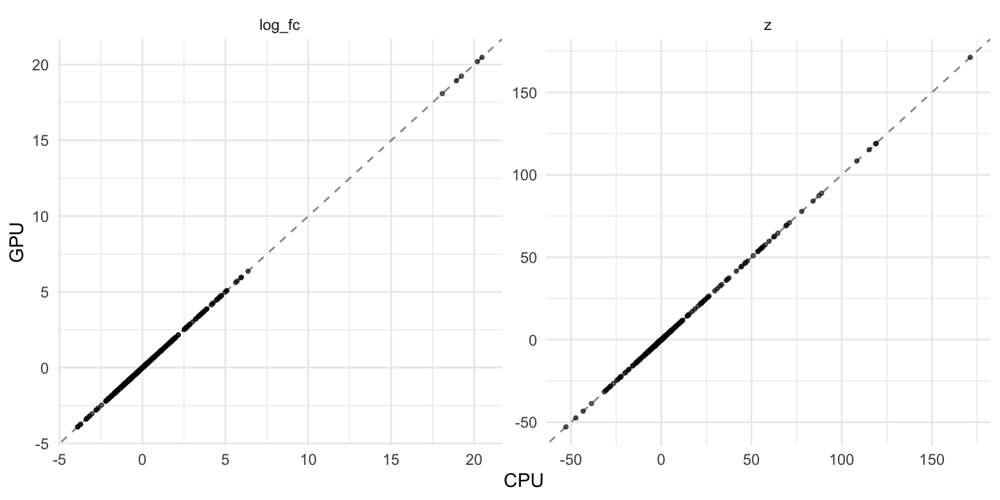

# GPU-accelerated NEBULA

## Intro

NEBULA fits a negative binomial gamma mixed model per gene, with the
donor as a random effect. Why you’d want that over a Wilcoxon test is
covered in the [differential expression
vignette](https://gregorlueg.github.io/bixverse/articles/differential_expression.html)
in `bixverse`. Read that first. This one only asks two questions: does
the GPU version give you the same answer, and is it faster?

[`nebula_gpu_sc()`](https://gregorlueg.github.io/bixverse.gpu/reference/nebula_gpu_sc.md)
is a drop-in for
[`bixverse::nebula_sc()`](https://gregorlueg.github.io/bixverse/reference/nebula_sc.html).
Same arguments, same `ScNebula` result. Stage two of NEBULA, the
per-gene penalised fits, runs on the device via
[cubecl](https://github.com/tracel-ai/cubecl). Cell ordering, gene
batching, the dispersion shrinkage and the Wald test are the CPU code.

Two differences are worth knowing about:

- The device fits run in `f32` and the host finishes each one in `f64`.
  The numbers land close to the CPU ones, not on them.
- REML is not implemented on the device.
  [`params_nebula_gpu()`](https://gregorlueg.github.io/bixverse.gpu/reference/params_nebula_gpu.md)
  is
  [`bixverse::params_nebula()`](https://gregorlueg.github.io/bixverse/reference/params_nebula.html)
  without the `reml` knob.

``` r

library(bixverse)
library(bixverse.gpu)
library(data.table)
library(ggplot2)
library(SingleCellExperiment)
```

## The data

Same set-up as the CPU vignette: the [Kang, et
al.](https://doi.org/10.1038/nbt.4042) PBMCs, eight lupus donors, each
split into an IFN-β stimulated and a control arm. Doublets out, then
CD14+ monocytes and their 500 most variable genes.

Load and subset the Kang data (click to expand)

``` r

sce <- qs2::qs_read(download_kang_pbmc())
sce <- sce[, sce$multiplets == "singlet" & !is.na(sce$cell)]

dir_kang <- file.path(tempdir(), "kang_gpu")
dir.create(dir_kang, showWarnings = FALSE, recursive = TRUE)

sc_object <- SingleCells(dir_data = dir_kang)
sc_object <- load_sce(
  object = sc_object,
  sce = sce,
  sc_qc_param = params_sc_min_quality(
    min_unique_genes = 200L,
    min_lib_size = 500L,
    min_cells = 20L,
    target_size = 1e4
  ),
  .verbose = FALSE
)

mono <- SingleCellsSubset(
  sc_object,
  grouping_column = "cell",
  group = "CD14+ Monocytes"
)

mono <- find_hvg_sc(mono, hvg_no = 500L, .verbose = FALSE)
hvgs <- get_gene_names_from_idx(mono, get_hvg(mono), rust_based = TRUE)
```

``` r

mono
#> Single cell experiment (subset).
#>   No cells: 5355
#>   No genes: 12132
#>   Group: cell = CD14+ Monocytes
#>   HVG calculated: TRUE
#>   PCA calculated: FALSE
#>   Other embeddings: none
#>   KNN generated: FALSE
#>   SNN generated: FALSE
#>   Stale artefacts: none
```

## The real contrast

Stimulated against control, donor as the random effect. Run both, time
both.

``` r

time_cpu <- system.time(
  res_cpu <- nebula_sc(
    object = mono,
    subject_col = "ind",
    design = ~stim,
    genes_to_use = hvgs,
    .verbose = TRUE
  )
)
```

``` r

time_gpu <- system.time(
  res_gpu <- nebula_gpu_sc(
    object = mono,
    subject_col = "ind",
    design = ~stim,
    genes_to_use = hvgs,
    .verbose = TRUE
  )
)
```

``` r

data.table(
  backend = c("CPU", "GPU"),
  seconds = c(time_cpu[["elapsed"]], time_gpu[["elapsed"]])
)
#>    backend seconds
#>     <char>   <num>
#> 1:     CPU   3.448
#> 2:     GPU   2.398
```

### How close are they?

Join the two result tables on the gene and look at the worst absolute
gap per column. Relative gaps are no use here: a gene with an effect of
`1e-3` turns an absolute gap in the fourth decimal into a 70% relative
one.

``` r

res_both <- merge(
  res_cpu$results,
  res_gpu$results,
  by = "gene_id",
  suffixes = c("_cpu", "_gpu")
)

cols <- c(
  "log_fc",
  "z",
  "p_value",
  "fdr",
  "subject_overdispersion",
  "cell_overdispersion"
)

rbindlist(lapply(cols, \(col) {
  a <- res_both[[paste0(col, "_cpu")]]
  b <- res_both[[paste0(col, "_gpu")]]
  data.table(
    column = col,
    max_abs_diff = max(abs(a - b)),
    pearson = cor(a, b)
  )
}))
#>                    column max_abs_diff  pearson
#>                    <char>        <num>    <num>
#> 1:                 log_fc 0.0006526261 1.000000
#> 2:                      z 0.0012607748 1.000000
#> 3:                p_value 0.0007529370 1.000000
#> 4:                    fdr 0.0008433680 1.000000
#> 5: subject_overdispersion 0.0055144379 0.999999
#> 6:    cell_overdispersion 0.2689521211 1.000000
```

``` r

plot_dt <- rbind(
  res_both[, .(stat = "log_fc", cpu = log_fc_cpu, gpu = log_fc_gpu)],
  res_both[, .(stat = "z", cpu = z_cpu, gpu = z_gpu)]
)

ggplot(plot_dt, aes(x = cpu, y = gpu)) +
  geom_abline(slope = 1, intercept = 0, colour = "grey60", linetype = 2) +
  geom_point(size = 0.8, alpha = 0.6) +
  facet_wrap(~stat, scales = "free") +
  labs(x = "CPU", y = "GPU") +
  theme_minimal()
```



What matters in the end is the calls. Same genes at FDR \<= 0.05?

``` r

res_both[, .(
  genes = .N,
  sig_cpu = sum(fdr_cpu <= 0.05),
  sig_gpu = sum(fdr_gpu <= 0.05),
  sig_both = sum(fdr_cpu <= 0.05 & fdr_gpu <= 0.05),
  bound_agree = sum(sigma_at_bound_cpu == sigma_at_bound_gpu),
  convergence_agree = sum(convergence_cpu == convergence_gpu)
)]
#>    genes sig_cpu sig_gpu sig_both bound_agree convergence_agree
#>    <int>   <int>   <int>    <int>       <int>             <int>
#> 1:   429     299     299      299         429               421
```

Every CPU call is a GPU call and vice versa. The top of the list, ranked
by the CPU’s `|z|`, side by side:

``` r

head(
  res_both[
    order(-abs(z_cpu)),
    .(gene_id, log_fc_cpu, log_fc_gpu, z_cpu, z_gpu)
  ],
  8
)
#>                     gene_id log_fc_cpu log_fc_gpu     z_cpu     z_gpu
#>                      <char>      <num>      <num>     <num>     <num>
#> 1:                    ISG15   4.650378   4.650378 171.20680 171.20680
#> 2:                    ISG20   3.663062   3.663062 119.09117 119.09117
#> 3: APOBEC3A_ENSG00000128383   3.520193   3.520193 118.75017 118.75017
#> 4:                   IFITM3   3.377843   3.377843 115.25370 115.25370
#> 5:                   CXCL10   5.614680   5.614680 108.35227 108.35227
#> 6:                     IFI6   2.671006   2.671006  88.77986  88.77986
#> 7:                     LY6E   3.366099   3.366099  87.34538  87.34538
#> 8:                     CCL8   5.968108   5.968108  84.06402  84.06402
```

The interferon response, ISG15, APOBEC3A and CXCL10, identical to the
printed precision. The one place the two disagree is the convergence
code, on a handful of genes:

``` r

res_both[
  convergence_cpu != convergence_gpu,
  .(gene_id, convergence_cpu, convergence_gpu, z_cpu, z_gpu, fdr_cpu, fdr_gpu)
]
#> Key: <gene_id>
#>    gene_id convergence_cpu convergence_gpu     z_cpu     z_gpu      fdr_cpu
#>     <char>           <int>           <int>     <num>     <num>        <num>
#> 1:   DDHD1               1             -10  1.398976  1.398976 1.994853e-01
#> 2:  DHRS7B               1             -10 -3.617794 -3.617794 5.928685e-04
#> 3:     DR1             -10               1 -4.940335 -4.940335 2.052579e-06
#> 4:  FGFBP2             -10               1 -2.131773 -2.131774 4.770352e-02
#> 5:    PGM2               1             -10 -2.555115 -2.555114 1.644028e-02
#> 6:    PHC1               1             -10 -1.597487 -1.597487 1.385847e-01
#> 7:  PLGRKT             -10               1  4.651144  4.651145 8.138629e-06
#> 8: TMEM41A               1             -10 -1.422732 -1.422731 1.913983e-01
#>         fdr_gpu
#>           <num>
#> 1: 1.994852e-01
#> 2: 5.928685e-04
#> 3: 2.052578e-06
#> 4: 4.770342e-02
#> 5: 1.644033e-02
#> 6: 1.385850e-01
#> 7: 8.138607e-06
#> 8: 1.913984e-01
```

The codes swap between `1` and `-10` in both directions. Both sit above
the `-20` line that marks a likely failure, and `z` and the FDR on these
genes still agree to five or six significant digits. Nothing here
changes a call.

## No contrast at all

The CPU vignette’s key check: control cells only, eight donors split
four against four at random. Any call is a false positive. If the GPU’s
`f32` fits nudged the overdispersions the wrong way, this is where extra
calls would show up.

``` r

obs_parent <- sc_object[[]]
donors <- sort(unique(obs_parent$ind))
group_a <- donors[c(1, 3, 5, 7)]

sc_object[["cell_stim"]] <- paste(obs_parent$cell, obs_parent$stim, sep = "__")
sc_object[["fake"]] <- ifelse(obs_parent$ind %in% group_a, "a", "b")

mono_ctrl <- SingleCellsSubset(
  sc_object,
  grouping_column = "cell_stim",
  group = "CD14+ Monocytes__ctrl"
)
```

``` r

null_cpu <- nebula_sc(
  object = mono_ctrl,
  subject_col = "ind",
  design = ~fake,
  genes_to_use = hvgs,
  .verbose = TRUE
)

null_gpu <- nebula_gpu_sc(
  object = mono_ctrl,
  subject_col = "ind",
  design = ~fake,
  genes_to_use = hvgs,
  .verbose = TRUE
)

data.table(
  backend = c("CPU", "GPU"),
  false_positives = c(
    null_cpu$results[fdr <= 0.05, .N],
    null_gpu$results[fdr <= 0.05, .N]
  )
)
#>    backend false_positives
#>     <char>           <int>
#> 1:     CPU               6
#> 2:     GPU               6
```

## Timing

On this data, 500 genes over 5355 cells, the CPU took 3.4 s and the GPU
2.4 s. One run each on an Apple Silicon laptop, device set-up included.
Across renders of this vignette the order has flipped both ways, so call
it a wash at this size. The whole sweep is seconds either way, and stage
one, the batching and the Wald test stay on the CPU in both, so the GPU
only ever takes over part of the run. Larger cell counts and longer gene
lists are where stage two grows, but that isn’t measured here. Benchmark
on your own data before committing to the GPU path.

## Where next

REML on the device isn’t there yet; use the CPU path if you need it.
NEBULA on `MetaCells` stays CPU-only for now too.
