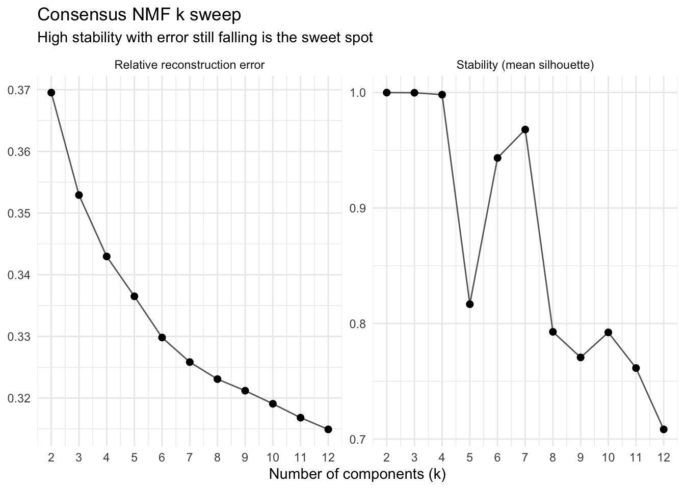

# GPU-accelerated NMF

## Intro

NMF factorises the counts into `V ≈ W H` with everything non-negative,
which is why the components read as additive gene programmes rather than
the plus-and-minus directions PCA gives you. `bixverse` solves it with
HALS (hierarchical alternating least squares), and this package moves
that solver onto the GPU.

What actually runs on the GPU: both Gram products, both data products,
the two HALS sweeps, the column normalisation and the objective. `V`,
`W` and `H` stay resident, so the only thing crossing back per iteration
is a small partials vector.

What does not: the NNDSVD initialisation, and the whole consensus
machinery. Pooling the components across restarts, the local-density
filter, the k-means, the silhouette and the per-coordinate median all
run on the CPU, shared verbatim with `bixverse`. That is deliberate.
Those operate on a `(k * n_runs) x dim` matrix with `k * n_runs` in the
hundreds, so they are nowhere near the solve in cost and porting them
would buy nothing.

So where does the GPU actually help? Not too much in a single fit. It
helps when the same matrix serves many solves, because `V` uploads once
and every restart and every rank reuses it. On the CPU each of those
solves pays full memory traffic over `V` again. The k sweep is
`length(k_range) * n_runs` solves over one matrix, which is exactly that
shape.

One limit to know up front: the kernels tier their workgroup width by
rank and stop at 128. Ask for more and you get an error pointing you at
the CPU version, not a silent fallback.

The params, the result classes and everything downstream are identical
to the CPU versions. If you have not seen those, read the [bixverse
bag-of-genes
vignette](https://gregorlueg.github.io/bixverse/articles/bag_of_genes_single_cells.html)
first.

``` r

library(bixverse)
library(bixverse.gpu)
library(data.table)
#> Warning: package 'data.table' was built under R version 4.5.2
library(ggplot2)
#> Warning: package 'ggplot2' was built under R version 4.5.2
library(magrittr)
#> Warning: package 'magrittr' was built under R version 4.5.2
```

> **Note**
>
> Vignettes were built locally on a MacBook Pro M1 Max. The GH runners
> were just too slow and do not have proper GPU support. This gives an
> idea of speed on a decent, but older machine.

## Rebuilding a processed CD34

Same CD34 cells as the other single cell vignettes for meta cells. Load,
pick HVGs, PCA. No QC needed, the data is already filtered.

Rebuild the CD34 cell object (click to expand)

``` r

cd34_path <- download_cd34_data()

tempdir_cd34 <- tempdir()

sc_object <- SingleCells(dir_data = tempdir_cd34)

sc_object <- load_h5ad(object = sc_object, h5_path = cd34_path)
#>  Using light streaming for the CSR to CSC conversion.
#> Loading observations data from h5ad into the DuckDB.
#> Loading variables data from h5ad into the DuckDB.

sc_object <- find_hvg_sc(
  object = sc_object,
  hvg_no = 2000L,
  .verbose = FALSE
)

sc_object <- calculate_pca_sc(
  object = sc_object,
  no_pcs = 30L,
  sparse_svd = FALSE
)
#> Using dense SVD solving on scaled data on 2000 HVG.

sc_object
#> Single cell experiment (Single Cells).
#>   No cells (original): 6881
#>    To keep n: 6881
#>   No genes: 12464
#>   HVG calculated: TRUE
#>   PCA calculated: TRUE
#>   Other embeddings: none
#>   KNN generated: FALSE
#>   SNN generated: FALSE
#>   MAGIC imputed: none
#>   Stale artefacts: none
```

## Picking k

You do not know `k` in advance, and NMF is non-convex, so a single fit
at a guessed rank tells you very little. Consensus NMF ([Kotliar et al.,
2019](https://elifesciences.org/articles/43803)) answers this by running
the fit many times from different random starts and asking which
programmes keep coming back.

[`nmf_k_sweep_gpu_sc()`](https://gregorlueg.github.io/bixverse.gpu/reference/nmf_k_sweep_gpu_sc.md)
does that across a range of ranks and reports stability (mean silhouette
of the consensus clusters) against reconstruction error. It keeps no
factors, so a wide range stays cheap in memory.

``` r

sweep_time <- system.time({
  k_sweep <- nmf_k_sweep_gpu_sc(
    object = sc_object,
    k_range = 2:12,
    n_runs = 10L,
    nmf_consensus_params = params_nmf_consensus(density_threshold = 2)
  )
})

k_sweep
#> NmfKSweepResult (consensus NMF k sweep)
#>   Source class:     SingleCells
#>   k range:          2 to 12
#>   No runs per k:    10
#>   Most stable k:    2 (stability = 0.9999)
#> 
#>         k stability best_error median_error consensus_failed n_dropped
#>     <int>     <num>      <num>        <num>           <lgcl>     <int>
#>  1:     2 0.9999074  0.3695188    0.3695305            FALSE         0
#>  2:     3 0.9997740  0.3529083    0.3529186            FALSE         0
#>  3:     4 0.9981312  0.3429484    0.3429652            FALSE         0
#>  4:     5 0.8167554  0.3362945    0.3364998            FALSE         0
#>  5:     6 0.9433510  0.3297761    0.3298202            FALSE         0
#>  6:     7 0.9679552  0.3257553    0.3258369            FALSE         0
#>  7:     8 0.7928372  0.3229811    0.3230748            FALSE         0
#>  8:     9 0.7706839  0.3205590    0.3211995            FALSE         0
#>  9:    10 0.7923468  0.3183019    0.3190773            FALSE         0
#> 10:    11 0.7614895  0.3166320    0.3168212            FALSE         0
#> 11:    12 0.7083961  0.3143754    0.3149250            FALSE         0
#>     n_empty_clusters n_converged
#>                <int>       <int>
#>  1:                0          10
#>  2:                0          10
#>  3:                0          10
#>  4:                0          10
#>  5:                0          10
#>  6:                0          10
#>  7:                0          10
#>  8:                0          10
#>  9:                0          10
#> 10:                0          10
#> 11:                0          10
```

``` r

plot(k_sweep)
```



Consensus NMF k sweep on the CD34 cells.

The rule of thumb is to take the last `k` before stability falls away,
while the error curve is still coming down. Error always falls with `k`,
so it never picks a rank on its own; stability is what stops you.

Do not just read off the most stable row. Low ranks are trivially
stable, since two components are hard to disagree about, and the header
will happily tell you `k = 2`. What you want is the last rank that still
holds up. Here stability sits near 1 through `k = 4`, dips at 5,
recovers at 6 and 7, then falls away from 8 onward and does not come
back. Error is still dropping at 7, so that is where we fit.

A note on `density_threshold = 2`. The filter drops components sitting
in a sparse neighbourhood, and 2 is the cosine ceiling, so that switches
it off. With 10 restarts it has very little to work with, and a run that
drops below `k` survivors errors out rather than quietly returning
something worse. Turn it back on once you are running 50 or more
restarts.

## Fitting at the chosen k

``` r

nmf_res <- consensus_nmf_gpu_sc(
  object = sc_object,
  k = 7L,
  n_runs = 20L,
  nmf_consensus_params = params_nmf_consensus(density_threshold = 2)
)

nmf_res
#> ConsensusNmfResult (consensus HALS NMF)
#>   Source class:     SingleCells
#>   No genes:         2000
#>   No cells:         6881
#>   No components:    7
#>   No runs:          20
#>   Stability:        0.9019
#>   Relative error:   0.3258
#>   Dropped:          0 / 140 components
#>   Preprocessing:    none
```

[`get_stability()`](https://gregorlueg.github.io/bixverse/reference/get_stability.html)
gives you the diagnostics behind the fit: the mean silhouette, the
relative reconstruction errors, and a row per pooled component recording
where it landed.

``` r

nmf_diag <- get_stability(nmf_res)

nmf_diag$stability
#> [1] 0.9019366

nmf_diag$cluster_sizes
#>    cluster     n
#>      <int> <int>
#> 1:       1    21
#> 2:       2    20
#> 3:       3    22
#> 4:       4    20
#> 5:       5    20
#> 6:       6    17
#> 7:       7    20
```

With 20 restarts, a cluster of 20 is a programme every run found. A thin
one is a programme only some initialisations saw, and it is worth a
squint before you build a story on it.

To read off what a programme is, rank the genes by their loading in `W`:

``` r

w_mat <- get_w(nmf_res)

top_genes <- lapply(colnames(w_mat), \(comp) {
  names(sort(w_mat[, comp], decreasing = TRUE))[1:10]
})
names(top_genes) <- colnames(w_mat)

top_genes[1:3]
#> $comp_01
#>  [1] "EEF1A1" "RPL13"  "RPL13A" "RPS23"  "RPS3"   "RPS24"  "RPS6"   "RPL19" 
#>  [9] "RPL28"  "RPS19" 
#> 
#> $comp_02
#>  [1] "NKAIN2"  "MEIS1"   "EEF1A1"  "RPL13"   "PLXDC2"  "ZNF385D" "INPP4B" 
#>  [8] "RPL13A"  "CALN1"   "RPS23"  
#> 
#> $comp_03
#>  [1] "EEF1A1"  "RPL13A"  "RPL13"   "ZNF385D" "RPS23"   "RPS6"    "RPS3"   
#>  [8] "PTMA"    "RPL19"   "RPS3A"
```

`H` is `k x cells`, so the activations drop straight onto an embedding
or into the obs table.

``` r

h_mat <- get_h(nmf_res)

dim(h_mat)
#> [1]    7 6881

round(h_mat[1:3, 1:4], 3)
#>         cd34_multiome_rep1#AAACAGCCACTCGCTC-1
#> comp_01                                20.415
#> comp_02                                 2.704
#> comp_03                                 3.809
#>         cd34_multiome_rep1#AAACAGCCACTGACCG-1
#> comp_01                                 0.000
#> comp_02                                 3.724
#> comp_03                                 0.000
#>         cd34_multiome_rep1#AAACAGCCATAATCAC-1
#> comp_01                                10.005
#> comp_02                                15.652
#> comp_03                                 2.624
#>         cd34_multiome_rep1#AAACATGCAAATTCGT-1
#> comp_01                                 7.715
#> comp_02                                15.218
#> comp_03                                 0.000
```

## CPU versus GPU

The honest comparison. Both solvers run the same HALS, the same number
of restarts and the same host-side consensus step, so the only thing
that differs is where the linear algebra happens.

``` r

gpu_time <- system.time({
  gpu_fit <- consensus_nmf_gpu_sc(
    object = sc_object,
    k = 7L,
    n_runs = 20L,
    nmf_consensus_params = params_nmf_consensus(density_threshold = 2),
    seed = 42L,
    .verbose = TRUE
  )
})

cpu_time <- system.time({
  cpu_fit <- consensus_nmf_sc(
    object = sc_object,
    k = 7L,
    n_runs = 20L,
    nmf_consensus_params = params_nmf_consensus(density_threshold = 2),
    seed = 42L,
    .verbose = TRUE
  )
})

data.table(
  version = c("CPU", "GPU"),
  seconds = round(c(cpu_time[["elapsed"]], gpu_time[["elapsed"]]), 2)
)[, speed_up := round(seconds[1] / seconds, 2)][]
#>    version seconds speed_up
#>     <char>   <num>    <num>
#> 1:     CPU   20.56     1.00
#> 2:     GPU    6.19     3.32
```

Do the two agree? Not bit for bit, and they cannot: f32 GEMM on the
device reduces in a different order than the CPU path, and NMF is
non-convex, so tiny differences early can send a restart to a different
local optimum. What has to match is the answer.

``` r

data.table(
  version = c("CPU", "GPU"),
  rel_error = round(c(cpu_fit$rel_error, gpu_fit$rel_error), 5),
  stability = round(c(cpu_fit$stability, gpu_fit$stability), 4)
)
#>    version rel_error stability
#>     <char>     <num>     <num>
#> 1:     CPU   0.32578    0.9019
#> 2:     GPU   0.32578    0.9019
```

One thing to keep in mind about the restarts: on the CPU they run across
cores, on the GPU they run one after the other on a single device. So
the GPU is giving up the easiest parallelism there is and still has to
win on the solve itself. That is also why the k sweep flatters it more
than a single consensus fit does: more solves over the same resident
matrix, and no extra upload for any of them.

## Meta cells

Everything above dispatches on `MetaCells` too, with the same generics.
Meta cells are the path where consensus NMF is genuinely affordable,
since a few thousand aggregates instead of a few hundred thousand cells
makes `n_runs = 50` unremarkable. See the [SEACells
vignette](https://gregorlueg.github.io/bixverse.gpu/articles/gpu_metacells.md)
for getting there.

``` r

mc_sweep <- nmf_k_sweep_gpu_sc(
  object = mc_object,
  k_range = 2:12,
  n_runs = 20L
)

mc_nmf <- consensus_nmf_gpu_sc(
  object = mc_object,
  k = 6L,
  n_runs = 20L
)
```

## What is next

The consensus step is now the floor on how fast this can get. Once the
solves move to the device, the pooling and the k-means start showing up
in the profile at large `n_runs`, and clustering in cell space
(`consensus_target = "w"`) is the pathological case: it pools a dense
`(k * n_runs) x n_cells` matrix and runs an exhaustive cosine search
over it. That one is worth porting.

The rank cap at 128 is a workgroup-tiering limit rather than anything
fundamental. It has not bitten in practice, since a 128-programme
factorisation of single cell data is well past interpretable, but it is
there.
