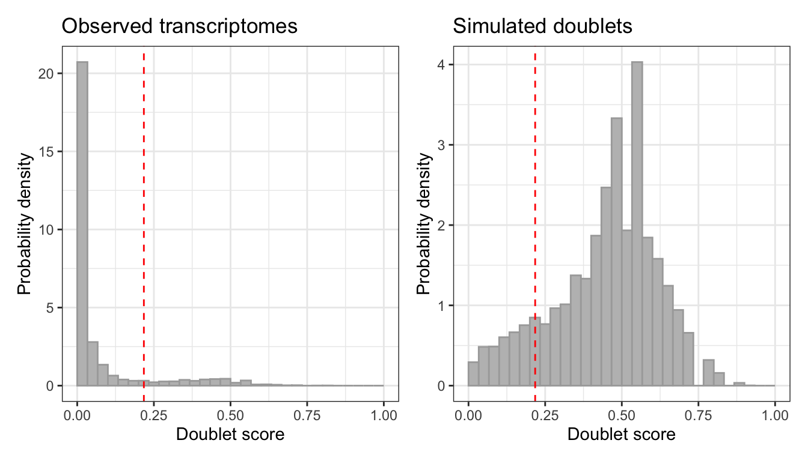
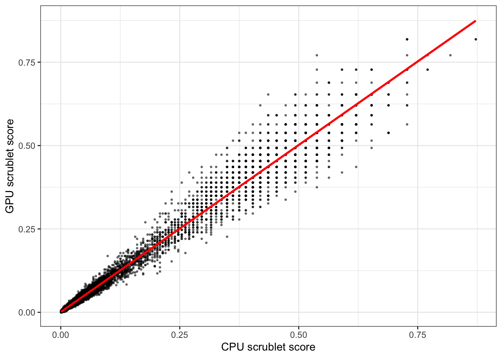

# GPU-accelerated Scrublet

## Intro

Scrublet ([Wolock et al.,
2019](https://www.sciencedirect.com/science/article/pii/S2405471218304745))
detects doublets by simulating them. It combines random pairs of
observed cells into artificial doublets, projects observed and simulated
cells into a shared PC space, builds a kNN graph over the lot, and
scores each observed cell by how many of its neighbours are simulated
doublets. Otsu’s method then cuts the score distribution into singlets
and doublets.

Three stages move to the GPU in
[`scrublet_gpu_sc()`](https://gregorlueg.github.io/bixverse.gpu/reference/scrublet_gpu_sc.md):
the randomised sparse SVD of the observed cells, the projection of the
simulated doublets into that PC space, and the kNN over the combined
embedding. HVG selection, the doublet simulation itself, the kNN
classifier and the Otsu threshold stay on the CPU.

So the win is bounded by how much of the run those three own, and that
share grows with cell count. The combined embedding is
`(1 + sim_doublet_ratio) * n_cells` rows tall, and an exhaustive kNN
over it is quadratic. At 5k cells the setup cost dominates and you will
not see much. At 100k it gets painful on the CPU and the GPU starts to
matter.

If you have not seen the CPU version, read the [bixverse doublet
detection
vignette](https://gregorlueg.github.io/bixverse/articles/doublet_detection.html)
first. The result class and everything downstream of it are identical
here.

``` r

library(bixverse)
library(bixverse.gpu)
library(data.table)
#> Warning: package 'data.table' was built under R version 4.5.2
library(magrittr)
#> Warning: package 'magrittr' was built under R version 4.5.2
library(ggplot2)
#> Warning: package 'ggplot2' was built under R version 4.5.2
```

> **Note**
>
> Vignettes were built locally on a MacBook Pro M1 Max. The GH runners
> were just too slow and do not have proper GPU support. This gives an
> idea of speed on a decent, but older machine.

## The data

PBMCs with demuxlet ground truth calls. Each barcode is classified as a
singlet (`SNG`) or a doublet (`DBL`), so there is something real to
score against.

Load the demuxlet PBMCs (click to expand)

``` r

doublet_path <- download_demuxlet_pbmc()

tempdir_doublet <- file.path(tempdir(), "demuxlet_bixverse_gpu")
dir.create(tempdir_doublet, showWarnings = FALSE, recursive = TRUE)

demuxlet_data <- fread(file.path(doublet_path, "demuxlet_calls.tsv"))

sc_object <- SingleCells(dir_data = tempdir_doublet)

mtx_io_params <- get_cell_ranger_params(doublet_path)
mtx_io_params$cells_as_rows <- TRUE

sc_object <- load_mtx(
  object = sc_object,
  sc_mtx_io_param = mtx_io_params,
  streaming = 0L
)
#>  Loading data directly into memory for CSR to CSC conversion.
#> Loading observations data from flat file into the DuckDB.
#> duckdb is storing downloaded extensions and secrets under ~/.duckdb:
#> ℹ /Users/gregorlueg/.duckdb
#> This persists across sessions and is shared with the DuckDB CLI and other clients.
#> ℹ Run duckdb(shared_home = FALSE) to use a temporary directory instead.
#> ℹ See ?duckdb_storage for details and alternatives.
#> Loading variable data from flat file into the DuckDB.
#> 
#> duckdb is storing downloaded extensions and secrets under ~/.duckdb:
#> ℹ /Users/gregorlueg/.duckdb
#> This persists across sessions and is shared with the DuckDB CLI and other clients.
#> ℹ Run duckdb(shared_home = FALSE) to use a temporary directory instead.
#> ℹ See ?duckdb_storage for details and alternatives.
#> duckdb is storing downloaded extensions and secrets under ~/.duckdb:
#> ℹ /Users/gregorlueg/.duckdb
#> This persists across sessions and is shared with the DuckDB CLI and other clients.
#> ℹ Run duckdb(shared_home = FALSE) to use a temporary directory instead.
#> ℹ See ?duckdb_storage for details and alternatives.
#> duckdb is storing downloaded extensions and secrets under ~/.duckdb:
#> ℹ /Users/gregorlueg/.duckdb
#> This persists across sessions and is shared with the DuckDB CLI and other clients.
#> ℹ Run duckdb(shared_home = FALSE) to use a temporary directory instead.
#> ℹ See ?duckdb_storage for details and alternatives.
#> duckdb is storing downloaded extensions and secrets under ~/.duckdb:
#> ℹ /Users/gregorlueg/.duckdb
#> This persists across sessions and is shared with the DuckDB CLI and other clients.
#> ℹ Run duckdb(shared_home = FALSE) to use a temporary directory instead.
#> ℹ See ?duckdb_storage for details and alternatives.
#> duckdb is storing downloaded extensions and secrets under ~/.duckdb:
#> ℹ /Users/gregorlueg/.duckdb
#> This persists across sessions and is shared with the DuckDB CLI and other clients.
#> ℹ Run duckdb(shared_home = FALSE) to use a temporary directory instead.
#> ℹ See ?duckdb_storage for details and alternatives.
#> duckdb is storing downloaded extensions and secrets under ~/.duckdb:
#> ℹ /Users/gregorlueg/.duckdb
#> This persists across sessions and is shared with the DuckDB CLI and other clients.
#> ℹ Run duckdb(shared_home = FALSE) to use a temporary directory instead.
#> ℹ See ?duckdb_storage for details and alternatives.
#> duckdb is storing downloaded extensions and secrets under ~/.duckdb:
#> ℹ /Users/gregorlueg/.duckdb
#> This persists across sessions and is shared with the DuckDB CLI and other clients.
#> ℹ Run duckdb(shared_home = FALSE) to use a temporary directory instead.
#> ℹ See ?duckdb_storage for details and alternatives.
#> duckdb is storing downloaded extensions and secrets under ~/.duckdb:
#> ℹ /Users/gregorlueg/.duckdb
#> This persists across sessions and is shared with the DuckDB CLI and other clients.
#> ℹ Run duckdb(shared_home = FALSE) to use a temporary directory instead.
#> ℹ See ?duckdb_storage for details and alternatives.
#> duckdb is storing downloaded extensions and secrets under ~/.duckdb:
#> ℹ /Users/gregorlueg/.duckdb
#> This persists across sessions and is shared with the DuckDB CLI and other clients.
#> ℹ Run duckdb(shared_home = FALSE) to use a temporary directory instead.
#> ℹ See ?duckdb_storage for details and alternatives.
#> duckdb is storing downloaded extensions and secrets under ~/.duckdb:
#> ℹ /Users/gregorlueg/.duckdb
#> This persists across sessions and is shared with the DuckDB CLI and other clients.
#> ℹ Run duckdb(shared_home = FALSE) to use a temporary directory instead.
#> ℹ See ?duckdb_storage for details and alternatives.
#> duckdb is storing downloaded extensions and secrets under ~/.duckdb:
#> ℹ /Users/gregorlueg/.duckdb
#> This persists across sessions and is shared with the DuckDB CLI and other clients.
#> ℹ Run duckdb(shared_home = FALSE) to use a temporary directory instead.
#> ℹ See ?duckdb_storage for details and alternatives.
#> duckdb is storing downloaded extensions and secrets under ~/.duckdb:
#> ℹ /Users/gregorlueg/.duckdb
#> This persists across sessions and is shared with the DuckDB CLI and other clients.
#> ℹ Run duckdb(shared_home = FALSE) to use a temporary directory instead.
#> ℹ See ?duckdb_storage for details and alternatives.
#> duckdb is storing downloaded extensions and secrets under ~/.duckdb:
#> ℹ /Users/gregorlueg/.duckdb
#> This persists across sessions and is shared with the DuckDB CLI and other clients.
#> ℹ Run duckdb(shared_home = FALSE) to use a temporary directory instead.
#> ℹ See ?duckdb_storage for details and alternatives.
#> duckdb is storing downloaded extensions and secrets under ~/.duckdb:
#> ℹ /Users/gregorlueg/.duckdb
#> This persists across sessions and is shared with the DuckDB CLI and other clients.
#> ℹ Run duckdb(shared_home = FALSE) to use a temporary directory instead.
#> ℹ See ?duckdb_storage for details and alternatives.
#> duckdb is storing downloaded extensions and secrets under ~/.duckdb:
#> ℹ /Users/gregorlueg/.duckdb
#> This persists across sessions and is shared with the DuckDB CLI and other clients.
#> ℹ Run duckdb(shared_home = FALSE) to use a temporary directory instead.
#> ℹ See ?duckdb_storage for details and alternatives.

sc_object
#> Single cell experiment (Single Cells).
#>   No cells (original): 14528
#>    To keep n: 14528
#>   No genes: 12622
#>   HVG calculated: FALSE
#>   PCA calculated: FALSE
#>   Other embeddings: none
#>   KNN generated: FALSE
#>   SNN generated: FALSE
#>   MAGIC imputed: none
#>   Stale artefacts: none
```

A small helper for precision, recall and F1 against the demuxlet calls.

``` r

doublet_metrics <- function(
  predicted,
  actual,
  pos_predicted = TRUE,
  pos_actual = "DBL"
) {
  tp <- sum(predicted == pos_predicted & actual == pos_actual)
  fp <- sum(predicted == pos_predicted & actual != pos_actual)
  fn <- sum(predicted != pos_predicted & actual == pos_actual)
  precision <- tp / (tp + fp)
  recall <- tp / (tp + fn)
  f1 <- 2 * (precision * recall) / (precision + recall)
  list(precision = precision, recall = recall, f1 = f1)
}
```

## Running it

``` r

gpu_params <- params_scrublet_gpu(expected_doublet_rate = 0.12)

gpu_time <- system.time({
  scrublet_gpu <- scrublet_gpu_sc(
    object = sc_object,
    scrublet_params = gpu_params
  )
})

scrublet_gpu
#> ScrubletRes: 14528 cells, 1765 doublets (12.1%)
#>   Threshold:              0.2174
#>   Detected doublet rate:  12.1%
#>   Detectable fraction:    87.7%
#>   Overall doublet rate:   13.9%
#>   Simulated doublets:     21792
```

``` r

plot(scrublet_gpu)
```



The result is bixverse’s `ScrubletRes`, not a GPU-specific class, so
[`get_data()`](https://gregorlueg.github.io/bixverse/reference/get_data.html),
[`call_doublets_manual()`](https://gregorlueg.github.io/bixverse/reference/call_doublets_manual.html)
and
[`add_sc_new_obs()`](https://gregorlueg.github.io/bixverse/reference/add_sc_new_obs.html)
all work exactly as they do on the CPU path.

``` r

gpu_dt <- get_data(scrublet_gpu)
gpu_dt[, Barcode := get_cell_names(sc_object)]
gpu_dt <- merge(gpu_dt, demuxlet_data, by = "Barcode")

doublet_metrics(predicted = gpu_dt$doublet, actual = gpu_dt$Call)
#> $precision
#> [1] 0.6628895
#> 
#> $recall
#> [1] 0.7504811
#> 
#> $f1
#> [1] 0.7039711
```

## Picking a kNN backend

The kNN over the combined embedding is the one stage where you get a
real choice, and
[`params_scrublet_gpu()`](https://gregorlueg.github.io/bixverse.gpu/reference/params_scrublet_gpu.md)
exposes it through `knn_backend`.

`"gpu"` with `knn_method = "exhaustive"` is the default. It is exact,
has no tuning knobs, and is usually the right answer up to a few hundred
thousand cells. `"ivf"` is approximate, flat in `k`, and only starts
paying off above that. Recall loss matters more here than it does
elsewhere, because the doublet score is a neighbour count: drop
neighbours and you bias every score downwards.

``` r

params_ivf <- params_scrublet_gpu(
  expected_doublet_rate = 0.12,
  knn = list(knn_method = "ivf", n_list = 512L, n_probe = 32L)
)

params_cpu_knn <- params_scrublet_gpu(
  expected_doublet_rate = 0.12,
  knn_backend = "cpu",
  knn = list(knn_method = "hnsw")
)
```

`knn_backend = "cpu"` keeps the CPU indices (kmknn, HNSW, Annoy,
NN-descent) while the SVD and the projection stay on the device. It
costs a host round trip on a matrix that is
`(1 + sim_doublet_ratio) * n_cells` rows tall, so it is there for
reproducing a CPU run, not for speed.

The two backends take different keys. `knn` is validated against
whichever backend you named, and a key that belongs to the other one
errors rather than being silently ignored:

``` r

params_scrublet_gpu(knn = list(m = 32L))
#> Error in `params_scrublet_gpu()`:
#> ! Unknown kNN parameter(s) for backend 'gpu': m. Allowed: k, knn_method, ann_dist, n_list, n_probe.
```

## CPU versus GPU

Same object, same parameters, same seed.

``` r

cpu_params <- params_scrublet(
  expected_doublet_rate = 0.12,
  pca = list(no_pcs = gpu_params$no_pcs)
)

cpu_time <- system.time({
  scrublet_cpu <- scrublet_sc(
    object = sc_object,
    scrublet_params = cpu_params
  )
})

data.table(
  version = c("CPU", "GPU"),
  seconds = round(c(cpu_time[["elapsed"]], gpu_time[["elapsed"]]), 2)
)[, speed_up := round(seconds[1] / seconds, 2)][]
#>    version seconds speed_up
#>     <char>   <num>    <num>
#> 1:     CPU    2.34     1.00
#> 2:     GPU    0.96     2.44
```

## Do the calls agree?

``` r

cpu_dt <- get_data(scrublet_cpu)
cpu_dt[, Barcode := get_cell_names(sc_object)]
cpu_dt <- merge(cpu_dt, demuxlet_data, by = "Barcode")

cpu_metrics <- doublet_metrics(cpu_dt$doublet, cpu_dt$Call)
gpu_metrics <- doublet_metrics(gpu_dt$doublet, gpu_dt$Call)

data.table(
  version = c("CPU", "GPU"),
  precision = round(c(cpu_metrics$precision, gpu_metrics$precision), 3),
  recall = round(c(cpu_metrics$recall, gpu_metrics$recall), 3),
  f1 = round(c(cpu_metrics$f1, gpu_metrics$f1), 3),
  threshold = round(c(scrublet_cpu$threshold, scrublet_gpu$threshold), 4)
)
#>    version precision recall    f1 threshold
#>     <char>     <num>  <num> <num>     <num>
#> 1:     CPU     0.667  0.752 0.707    0.2185
#> 2:     GPU     0.663  0.750 0.704    0.2174
```

``` r

ggplot(
  data = data.table(
    cpu = scrublet_cpu$doublet_scores_obs,
    gpu = scrublet_gpu$doublet_scores_obs
  ),
  mapping = aes(x = cpu, y = gpu)
) +
  geom_point(size = 0.5, alpha = 0.5) +
  geom_smooth(method = "lm", colour = "red", se = TRUE) +
  xlab("CPU scrublet score") +
  ylab("GPU scrublet score") +
  theme_bw()
#> `geom_smooth()` using formula = 'y ~ x'
```



``` r

cor(
  scrublet_cpu$doublet_scores_obs,
  scrublet_gpu$doublet_scores_obs,
  method = "pearson"
)
#> [1] 0.9901312
```

The scores correlate, they do not match. Both paths use a randomised SVD
but draw a different sketch, and the GPU index breaks neighbour ties
differently. On top of that Otsu’s threshold is a step function of the
histogram bins, so the cut can land one bin over and flip a handful of
borderline cells. Judge the two by their metrics, not by a diff.

## Per-sample runs

Doublet rates track cell loading, so a pooled experiment usually wants
one threshold per sample rather than one for everything. `group_by` runs
the whole pipeline per level and stitches the results back together in
original cell order.

``` r

scrublet_grouped <- scrublet_gpu_sc(
  object = sc_object,
  scrublet_params = gpu_params,
  group_by = "sample_id"
)

scrublet_grouped$threshold
```

`threshold` comes back as a named vector, one entry per group, and
`call_doublets_manual(..., for_sample = "sample_A")` adjusts a single
group without touching the others.

## Clean up

``` r

unlink(tempdir_doublet, recursive = TRUE, force = TRUE)
```

## What is next

HVG selection is the obvious next lever. It is a full pass over the
gene-major store and on wide data it can outweigh the SVD it feeds. The
doublet simulation is disk-bound rather than compute-bound, so that one
probably stays on the host. Watch this space.
