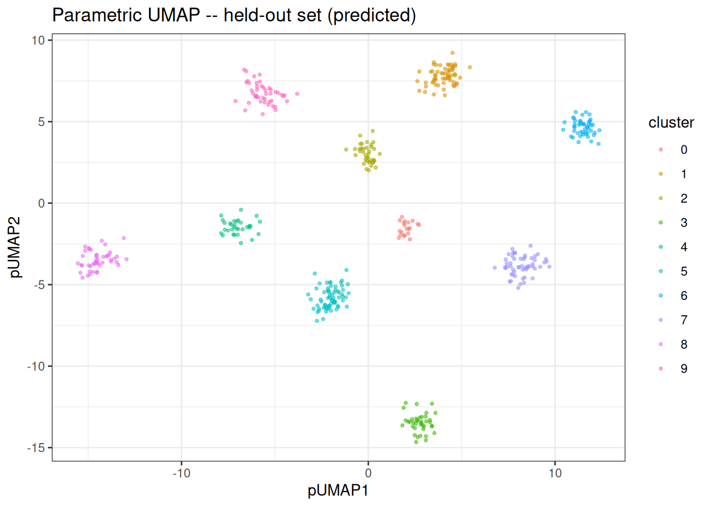
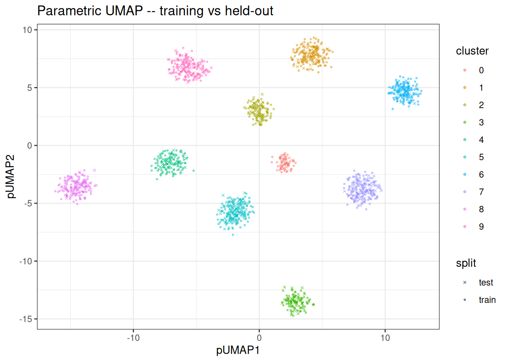

# Using Parametric UMAP

## Parametric UMAP

### Preamble

The [parametric UMAP](https://arxiv.org/abs/2009.12981) is an extension
of the [UMAP](https://arxiv.org/abs/1802.03426) algorithm. Rust-based
implementations with interface to R are available in
[manifoldsR](https://gregorlueg.github.io/manifoldsR/articles/umap.html)
for standard UMAP. This version here is the parametric UMAP and we will
go into more detail what is different here compared to the “normal”
version below.

### Intro

Standard UMAP can project new data onto an existing embedding, but doing
so requires retaining the kNN index and the training embedding, then
running a constrained optimisation that is both iterative and
non-deterministic. Parametric UMAP takes a different approach: it trains
a neural network encoder (an MLP) that learns an explicit function from
the input space to the embedding space. Once trained, projecting new
data is a single deterministic forward pass through the network… No
neighbour lookup, no re-optimisation, and the same input always produces
the same output.

The training is GPU-accelerated via [wgpu](https://wgpu.rs/) (or can be
also run on CPU via ndarray with OpenBLAS or Accelerate BLAS
acceleration), so a compatible GPU is beneficial but not strictly
required.

``` r
library(bixverse.gpu)
library(manifoldsR)
library(ggplot2)
library(data.table)
```

### Generating data

We generate a small clustered data set and split it into a training and
held-out set. The training set is used to fit the parametric UMAP model;
the held-out set is then projected through the trained encoder via
[`predict()`](https://rdrr.io/r/stats/predict.html). We will be using
the synthetic you might know from the `manifoldsR` package. To make this
run faster, we will use a small data set here.

``` r
set.seed(42L)

cluster_data <- manifold_synthetic_data(
  type = "cluster",
  n_samples = 1500L,
  parameters = params_clusters(n_clusters = 10L)
)

n <- nrow(cluster_data$data)
train_idx <- sample(seq_len(n), size = floor(0.7 * n))

train_data <- cluster_data$data[train_idx, ]
train_labels <- cluster_data$membership[train_idx]

test_data <- cluster_data$data[-train_idx, ]
test_labels <- cluster_data$membership[-train_idx]
```

### Fitting the model

[`parametric_umap()`](https://gregorlueg.github.io/bixverse.gpu/reference/parametric_umap.md)
returns a `ParametricUmapModel` object that holds both the training
embedding and the trained encoder. As this is small data, we will just
use the CPU version for 100 epochs, more than enough here.

``` r
pumap <- parametric_umap(
  data = train_data,
  n_dim = 2L,
  k = 15L,
  min_dist = 0.5,
  spread = 1.0,
  knn_method = "hnsw",
  parametric_umap_params = params_parametric_umap(
    batch_size = 128L,
    n_epochs = 100L
  ),
  use_gpu = FALSE,
  seed = 42L
)

pumap
#> Parametric UMAP Model
#>   Samples: 1050 | Features: 32 | Embedding dims: 2
#>   k: 15 | min_dist: 0.500 | spread: 1.0 | knn: hnsw
```

The training embedding is stored in `pumap$embedding` and can be
visualised directly.

``` r
train_df <- as.data.table(pumap$embedding) |>
  setnames(c("pUMAP1", "pUMAP2"))
train_df[, cluster := as.factor(train_labels)]

ggplot(train_df, aes(x = pUMAP1, y = pUMAP2)) +
  geom_point(aes(colour = cluster), size = 0.75, alpha = 0.5) +
  theme_bw() +
  ggtitle("Parametric UMAP: training set")
```


### Predicting on new data

Because the model has learnt an explicit mapping, we can embed the
held-out data without re-running the full algorithm.

``` r
test_embedding <- predict(pumap, newdata = test_data)

test_df <- as.data.table(test_embedding) |>
  setnames(c("pUMAP1", "pUMAP2"))
test_df[, cluster := as.factor(test_labels)]

ggplot(test_df, aes(x = pUMAP1, y = pUMAP2)) +
  geom_point(aes(colour = cluster), size = 0.75, alpha = 0.5) +
  theme_bw() +
  ggtitle("Parametric UMAP -- held-out set (predicted)")
```



### Comparing training and held-out embeddings

We can overlay both sets to confirm that the encoder generalises and
places held-out points in consistent positions relative to the training
embedding.

``` r
train_df[, split := "train"]
test_df[, split := "test"]
combined_df <- rbindlist(list(train_df, test_df))

ggplot(combined_df, aes(x = pUMAP1, y = pUMAP2)) +
  geom_point(
    aes(colour = cluster, shape = split),
    size = 0.75,
    alpha = 0.5
  ) +
  scale_shape_manual(values = c(train = 16, test = 4)) +
  theme_bw() +
  ggtitle("Parametric UMAP -- training vs held-out")
```



### Notes

Parametric UMAP inherits the same strengths and weaknesses as standard
UMAP with respect to the loss function: it excels at preserving cluster
structure but can distort continuous manifolds. The key advantage is the
reusable encoder: once trained (even if a bit slower), embedding new
data is a single forward pass through the network rather than a full
re-optimisation. Just be wary of out-of-distribution predictions… If you
have a massive batch effect things won’t look pretty.
